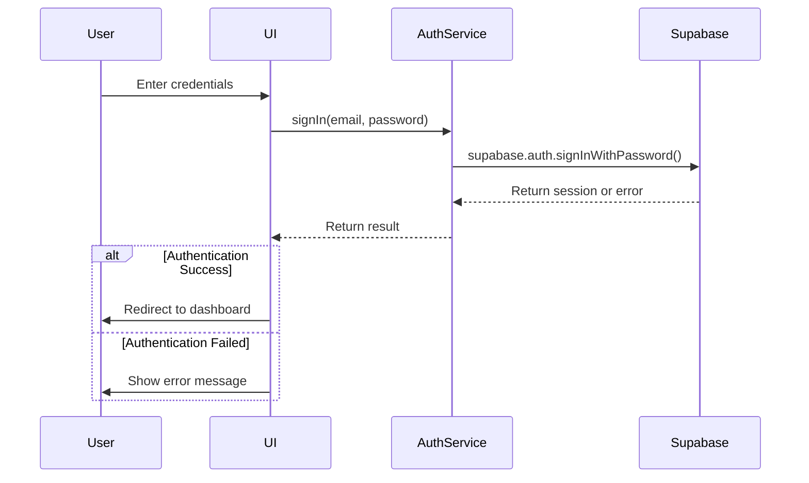
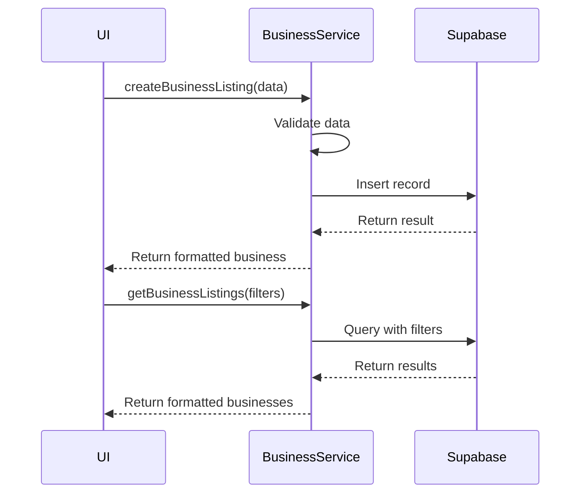
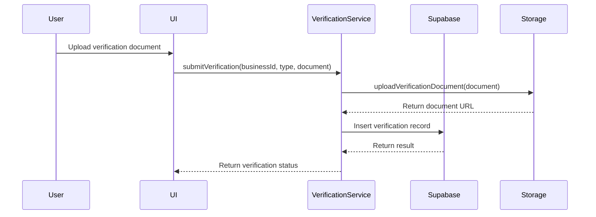
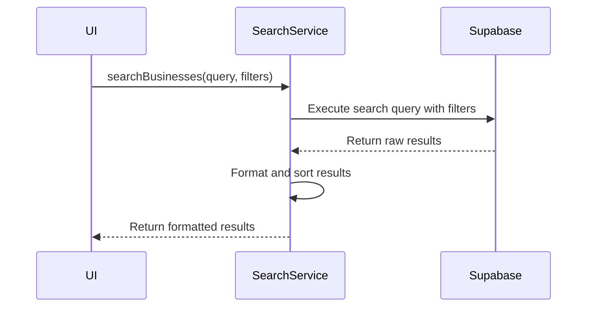

# API Service Layer Documentation

This document outlines the service layer that facilitates communication between the frontend application and the Supabase backend for the Connectiverse Africa Business Marketplace Platform.

## Overview

The service layer consists of TypeScript modules that abstract database operations, authentication flows, and business logic. These services follow a consistent pattern and provide type safety using TypeScript interfaces.

## Authentication Services

### Authentication Flow



### Core Authentication Methods

| Method Name | Parameters | Return Type | Description |
|-------------|------------|-------------|-------------|
| signIn | email: string, password: string | Promise<AuthResponse\> | Authenticates a user using email and password |
| signUp | email: string, password: string, userData: UserData | Promise<AuthResponse\> | Registers a new user account |
| signOut | None | Promise<void\> | Signs out the current user |
| resetPassword | email: string | Promise<ResetResponse\> | Initiates password reset flow |
| getCurrentUser | None | Promise<User \| null\> | Gets the currently authenticated user |
| updateUserProfile | userData: Partial<UserProfile\> | Promise<UserProfile\> | Updates user profile information |

## Business Listing Services

### Business Listing Operations



### Core Business Listing Methods

| Method Name | Parameters | Return Type | Description |
|-------------|------------|-------------|-------------|
| createBusinessListing | data: BusinessListingInput | Promise<BusinessListing\> | Creates a new business listing |
| updateBusinessListing | id: string, data: Partial<BusinessListingInput\> | Promise<BusinessListing\> | Updates an existing business listing |
| getBusinessListing | id: string | Promise<BusinessListing \| null\> | Retrieves a single business listing by ID |
| getBusinessListings | filters?: BusinessFilters, page?: number, limit?: number | Promise<PaginatedResult<BusinessListing\>\> | Retrieves multiple business listings with optional filtering and pagination |
| deleteBusinessListing | id: string | Promise<void\> | Deletes a business listing |
| getBusinessListingsByUser | userId: string | Promise<BusinessListing[]\> | Gets all business listings for a specific user |
| searchBusinessListings | query: string, filters?: BusinessFilters | Promise<BusinessListing[]\> | Searches business listings by keywords with optional filters |
| incrementBusinessViews | id: string | Promise<void\> | Increments the view counter for a business listing |
| incrementBusinessInquiries | id: string | Promise<void\> | Increments the inquiry counter for a business listing |
| getRelatedBusinesses | id: string, limit?: number | Promise<BusinessListing[]\> | Gets related business listings based on industry and location |

## Asset Listing Services

### Core Asset Listing Methods

| Method Name | Parameters | Return Type | Description |
|-------------|------------|-------------|-------------|
| createAssetListing | data: AssetListingInput | Promise<AssetListing\> | Creates a new asset listing |
| updateAssetListing | id: string, data: Partial<AssetListingInput\> | Promise<AssetListing\> | Updates an existing asset listing |
| getAssetListing | id: string | Promise<AssetListing \| null\> | Retrieves a single asset listing by ID |
| getAssetListings | filters?: AssetFilters, page?: number, limit?: number | Promise<PaginatedResult<AssetListing\>\> | Retrieves multiple asset listings with optional filtering and pagination |
| deleteAssetListing | id: string | Promise<void\> | Deletes an asset listing |
| searchAssetListings | query: string, filters?: AssetFilters | Promise<AssetListing[]\> | Searches asset listings by keywords with optional filters |
| getAssetsByBusiness | businessId: string | Promise<AssetListing[]\> | Gets all assets associated with a business |
| getAssetsByType | typeId: string | Promise<AssetListing[]\> | Gets assets of a specific type |
| getAssetsByCategory | categoryId: string | Promise<AssetListing[]\> | Gets assets in a specific category |

## Verification and Trust Services

### Verification Flow



### Core Verification Methods

| Method Name | Parameters | Return Type | Description |
|-------------|------------|-------------|-------------|
| submitVerification | businessId: string, verificationTypeId: string, document: File | Promise<VerificationSubmission\> | Submits a verification document for review |
| getVerificationStatus | businessId: string, verificationTypeId: string | Promise<VerificationStatus\> | Gets the status of a verification submission |
| getBusinessVerifications | businessId: string | Promise<VerificationRecord[]\> | Gets all verification records for a business |
| approveVerification | verificationId: string, adminId: string | Promise<void\> | Admin method to approve a verification |
| rejectVerification | verificationId: string, adminId: string, reason: string | Promise<void\> | Admin method to reject a verification |
| getVerificationTypes | None | Promise<VerificationType[]\> | Gets all available verification types |

## Review and Q&A Services

### Core Review Methods

| Method Name | Parameters | Return Type | Description |
|-------------|------------|-------------|-------------|
| createReview | businessId: string, userId: string, rating: number, comment: string | Promise<Review\> | Creates a new business review |
| getBusinessReviews | businessId: string, page?: number, limit?: number | Promise<PaginatedResult<Review\>\> | Gets reviews for a specific business |
| getUserReviews | userId: string | Promise<Review[]\> | Gets all reviews written by a user |
| updateReview | reviewId: string, data: Partial<ReviewInput\> | Promise<Review\> | Updates an existing review |
| deleteReview | reviewId: string | Promise<void\> | Deletes a review |

### Core Q&A Methods

| Method Name | Parameters | Return Type | Description |
|-------------|------------|-------------|-------------|
| askQuestion | businessId: string, userId: string, question: string | Promise<Question\> | Asks a question about a business |
| answerQuestion | questionId: string, userId: string, answer: string | Promise<Answer\> | Answers a question about a business |
| getBusinessQuestions | businessId: string, page?: number, limit?: number | Promise<PaginatedResult<QuestionWithAnswers\>\> | Gets questions for a specific business with their answers |
| updateQuestion | questionId: string, question: string | Promise<Question\> | Updates an existing question |
| updateAnswer | answerId: string, answer: string | Promise<Answer\> | Updates an existing answer |
| deleteQuestion | questionId: string | Promise<void\> | Deletes a question and its answers |
| deleteAnswer | answerId: string | Promise<void\> | Deletes an answer |

## Favorites and User Preference Services

### Core Favorites Methods

| Method Name | Parameters | Return Type | Description |
|-------------|------------|-------------|-------------|
| addFavorite | userId: string, businessId?: string, assetId?: string | Promise<Favorite\> | Adds a business or asset to user's favorites |
| removeFavorite | favoriteId: string | Promise<void\> | Removes an item from favorites |
| getUserFavorites | userId: string | Promise<Favorite[]\> | Gets all favorites for a user |
| isFavorite | userId: string, businessId?: string, assetId?: string | Promise<boolean\> | Checks if an item is in user's favorites |

## Search and Discovery Services

### Search Flow



### Core Search Methods

| Method Name | Parameters | Return Type | Description |
|-------------|------------|-------------|-------------|
| searchBusinesses | query: string, filters?: BusinessSearchFilters | Promise<BusinessListing[]\> | Searches businesses by keywords and filters |
| searchAssets | query: string, filters?: AssetSearchFilters | Promise<AssetListing[]\> | Searches assets by keywords and filters |
| getFilterOptions | filterType: string | Promise<FilterOption[]\> | Gets available filter options for a filter type |
| saveSearch | userId: string, query: string, filters: any | Promise<SavedSearch\> | Saves a search for later use |
| getSavedSearches | userId: string | Promise<SavedSearch[]\> | Gets saved searches for a user |
| removeSavedSearch | searchId: string | Promise<void\> | Removes a saved search |

## Admin Services

### Core Admin Methods

| Method Name | Parameters | Return Type | Description |
|-------------|------------|-------------|-------------|
| getUsers | page?: number, limit?: number | Promise<PaginatedResult<User\>\> | Gets all users with pagination |
| updateUserStatus | userId: string, status: UserStatus | Promise<User\> | Updates a user's status (active, suspended, etc.) |
| getPendingVerifications | page?: number, limit?: number | Promise<PaginatedResult<VerificationSubmission\>\> | Gets pending verification submissions |
| getReportedContent | contentType: string, page?: number, limit?: number | Promise<PaginatedResult<ReportedContent\>\> | Gets reported content (listings, reviews, etc.) |
| getActivityMetrics | dateRange: DateRange | Promise<ActivityMetrics\> | Gets platform activity metrics |
| getRevenueMetrics | dateRange: DateRange | Promise<RevenueMetrics\> | Gets platform revenue metrics |

## Error Handling

All service methods follow a consistent error handling pattern:

1. Validation errors are thrown before making database calls
2. Database errors are caught and transformed into user-friendly errors
3. All errors include appropriate HTTP status codes and error messages
4. Authentication errors are handled specially to trigger authentication flows

### Error Object Structure

```typescript
interface ServiceError {
  code: string;        // Machine-readable error code (e.g., "INVALID_INPUT")
  message: string;     // Human-readable error message
  status: number;      // HTTP status code equivalent
  details?: any;       // Additional error details (optional)
}
```

## Supabase Integration

All services are built on top of the Supabase client, which provides:

1. Built-in authentication and authorization
2. Real-time subscriptions for dynamic data
3. Storage capabilities for documents and images
4. Row-level security for data protection

### Supabase Client Configuration

```typescript
import { createClient } from '@supabase/supabase-js';

const supabaseUrl = import.meta.env.VITE_SUPABASE_URL;
const supabaseAnonKey = import.meta.env.VITE_SUPABASE_ANON_KEY;

export const supabase = createClient(supabaseUrl, supabaseAnonKey);
```

## Recommendations for Service Layer Enhancements

1. Implement caching for frequently accessed data
2. Add support for offline operations with background sync
3. Enhance error reporting with more detailed error types
4. Implement retry logic for transient failures
5. Add comprehensive logging for debugging and analytics
6. Support bulk operations for improved performance
7. Implement rate limiting for API calls to prevent abuse