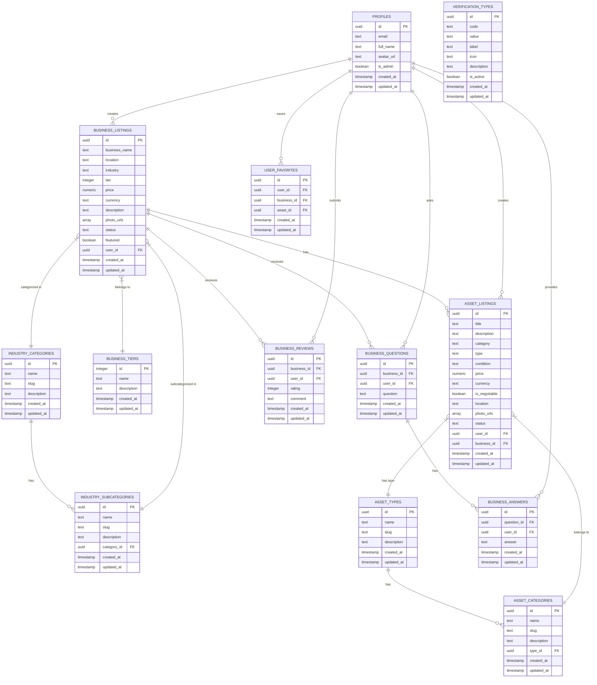

# Database Entity Relationship Diagram (ERD)

This document provides a comprehensive overview of the database schema for the Connectiverse Africa Business Marketplace Platform.

## Overview

The database is structured to support the core features of the platform:
- Business Listings (formal and informal)
- Asset Listings
- User Profiles and Authentication
- Trust and Verification System
- Industry Categorization
- Reviews and Q&A
- Favorites and Saved Searches

## Main Entities and Relationships

## Table Descriptions

### PROFILES
Stores user information including authentication details and preferences. Each user can be either a standard user or an admin.

### BUSINESS_LISTINGS
Central table for storing business listings with essential details like name, location, industry, price, and status. Links to user profiles, tiers, and industry categories.

### ASSET_LISTINGS
Stores assets for sale, which can be independent or linked to a business. Supports various asset types including equipment, real estate, intellectual property, and digital assets.

### BUSINESS_TIERS
Defines the different tiers of businesses (currently gold, silver, bronze). The PRD mentions Tier 1-4 which could be implemented by renaming these or adding a fourth tier.

### VERIFICATION_TYPES
Stores the different types of verification badges that can be applied to businesses, such as "Revenue Verified," "Identity Verified," etc.

### INDUSTRY_CATEGORIES / INDUSTRY_SUBCATEGORIES
Hierarchical structure for categorizing businesses by industry, with subcategories for more specific classification.

### ASSET_TYPES / ASSET_CATEGORIES
Hierarchical structure for categorizing assets by type and category, supporting the diverse range of assets that can be listed.

### BUSINESS_REVIEWS
Stores user reviews for businesses, including ratings and comments.

### BUSINESS_QUESTIONS / BUSINESS_ANSWERS
Implements the Q&A system where users can ask questions about businesses and receive answers from the business owners or other users.

### USER_FAVORITES
Tracks user's saved/favorite businesses and assets for quick access.

## Key Constraints and Relationships

1. Each business listing is created by one user (PROFILES.id → BUSINESS_LISTINGS.user_id)
2. Each asset listing is created by one user and can be associated with a business
3. Businesses are categorized into tiers, industries, and subcategories
4. Assets are categorized by types and categories
5. Reviews, questions, and answers are linked to specific businesses and users
6. User favorites link users to businesses or assets they've saved

## Data Integrity Rules

1. Business and asset listings must have a status (active, pending, sold, etc.)
2. Users must have a valid email address
3. Prices must be positive values
4. Ratings must be within a valid range (e.g., 1-5)
5. Creation and update timestamps are automatically managed
6. Deleted users should not result in deleted listings (maintain data integrity)

## Recommendations for Schema Enhancement

1. Add a CURRENCIES table to standardize the currency options (NGN, KES, GHS, ZAR, XOF)
2. Implement geospatial columns in BUSINESS_LISTINGS for advanced location-based search
3. Create a SAVED_SEARCHES table to implement the saved search feature mentioned in the PRD
4. Add a MESSAGES table to support in-app messaging between users
5. Consider renaming business tiers to align with the PRD (Tier 1-4)
6. Add a TRANSACTIONS table to track business and asset sales
7. Implement escrow-related tables for secure payment processing