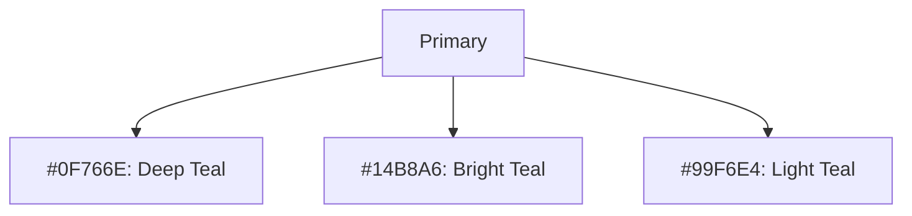
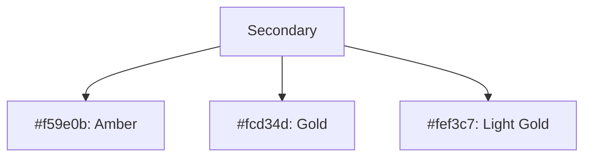
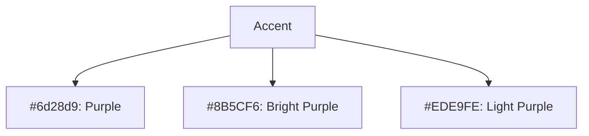
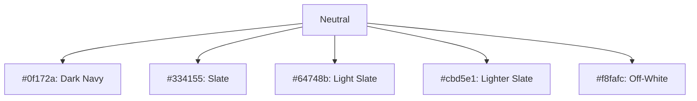
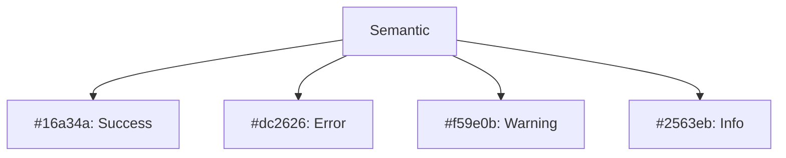

# Component Library Style Guide

This document provides comprehensive guidelines for the UI component system used in the Connectiverse Africa Business Marketplace Platform. The platform utilizes a component-based architecture built with shadcn-ui, React, TypeScript, and Tailwind CSS.

## Design System Overview

The platform's design system is built on the following principles:

1. **Consistency**: Unified appearance and behavior across the application
2. **Accessibility**: WCAG 2.1 AA compliance for all components
3. **Responsiveness**: Mobile-first design that works across all screen sizes
4. **Localization-friendly**: Components support RTL languages and text expansion
5. **Low-bandwidth optimized**: Minimalistic design with optimized asset loading

## Color System

The color palette reflects the vibrant yet professional nature of African business markets, with careful consideration for accessibility and cultural significance.

### Primary Colors



### Secondary Colors



### Accent Colors



### Neutral Colors



### Semantic Colors



### Color Usage Guidelines

- Use primary colors for main actions and branding
- Use secondary colors for calls-to-action and highlights
- Use accent colors sparingly for key elements that need attention
- Use semantic colors consistently for status indicators
- Maintain minimum 4.5:1
 contrast ratio for text
- Test color combinations for color blindness accessibility

## Typography

The typography system uses a clear hierarchy with responsive scaling.

### Font Family

- **Primary Font**: Inter, sans-serif
- **Secondary Font**: Playfair Display, serif (for headings and special content)
- **Fallback Stack**: system-ui, -apple-system, BlinkMacSystemFont, sans-serif

### Type Scale

| Name      | Size (px/rem) | Weight | Line Height | Usage                       |
|-----------|---------------|--------|-------------|------------------------------|
| Display   | 48px/3rem     | 700    | 1.1         | Large Heroes, Landing Pages |
| Heading 1 | 36px/2.25rem  | 700    | 1.2         | Page Titles                 |
| Heading 2 | 30px/1.875rem | 700    | 1.2         | Section Titles              |
| Heading 3 | 24px/1.5rem   | 600    | 1.3         | Card Titles, Group Headers  |
| Heading 4 | 20px/1.25rem  | 600    | 1.3         | Sub-section Titles          |
| Heading 5 | 18px/1.125rem | 600    | 1.4         | Widget Titles               |
| Heading 6 | 16px/1rem     | 600    | 1.4         | Small Section Headers       |
| Body      | 16px/1rem     | 400    | 1.5         | Main Text Content           |
| Body Small| 14px/0.875rem | 400    | 1.5         | Secondary Text              |
| Caption   | 12px/0.75rem  | 400    | 1.5         | Labels, Captions            |

### Typographic Guidelines

- Use responsive font sizing with rem units
- Maintain sufficient contrast between text and background
- Use proper line height to ensure readability
- Limit line length to 60-80 characters for optimal readability
- Use consistent text alignment (left-aligned for most content)
- Implement proper spacing between paragraphs and sections

## Spacing System

The spacing system uses a consistent scale based on 4px increments (0.25rem).

| Token   | Size (px/rem) | Usage                         |
|---------|---------------|-------------------------------|
| space-0 | 0px/0rem      | No spacing                    |
| space-1 | 4px/0.25rem   | Smallest spacing, tight items |
| space-2 | 8px/0.5rem    | Default compact spacing       |
| space-3 | 12px/0.75rem  | Tight spacing between elements|
| space-4 | 16px/1rem     | Standard spacing              |
| space-5 | 20px/1.25rem  | Medium spacing                |
| space-6 | 24px/1.5rem   | Default section spacing       |
| space-8 | 32px/2rem     | Large spacing between sections|
| space-10| 40px/2.5rem   | Extra large spacing           |
| space-12| 48px/3rem     | Maximum component spacing     |
| space-16| 64px/4rem     | Page section spacing          |
| space-20| 80px/5rem     | Large page section spacing    |
| space-24| 96px/6rem     | Maximum layout spacing        |

### Spacing Guidelines

- Use the spacing system consistently across all components
- Apply appropriate spacing for different screen sizes
- Use consistent margins and padding within components
- Maintain proper spacing between related and unrelated elements
- Consider content density requirements for different user types

## Core Components

### Button Component

The Button component provides consistent styling for interactive elements throughout the application.

#### Button Variants

```typescript
type ButtonVariant = 'primary' | 'secondary' | 'outline' | 'ghost' | 'link' | 'destructive';
type ButtonSize = 'xs' | 'sm' | 'md' | 'lg' | 'xl';
```

#### Button Props

```typescript
interface ButtonProps extends React.ButtonHTMLAttributes<HTMLButtonElement> {
  variant?: ButtonVariant;
  size?: ButtonSize;
  isLoading?: boolean;
  leftIcon?: React.ReactNode;
  rightIcon?: React.ReactNode;
  fullWidth?: boolean;
}
```

#### Button Usage

```tsx
<Button variant="primary" size="md">
  Create Listing
</Button>

<Button variant="outline" size="sm" leftIcon={<PlusIcon />}>
  Add Photo
</Button>

<Button variant="ghost" rightIcon={<ArrowRightIcon />}>
  View More
</Button>

<Button variant="destructive" isLoading={isSubmitting}>
  Delete Listing
</Button>
```

#### Button Accessibility

- Use appropriate ARIA attributes for loading state
- Ensure focus visibility for keyboard navigation
- Maintain sufficient size for touch targets (minimum 44px)
- Use descriptive text for actions

### Input Component

The Input component provides consistent styling for text entry fields.

#### Input Variants

```typescript
type InputVariant = 'outline' | 'filled' | 'flushed';
type InputSize = 'sm' | 'md' | 'lg';
```

#### Input Props

```typescript
interface InputProps extends React.InputHTMLAttributes<HTMLInputElement> {
  variant?: InputVariant;
  size?: InputSize;
  label?: string;
  error?: string;
  helperText?: string;
  leftAddon?: React.ReactNode;
  rightAddon?: React.ReactNode;
  isRequired?: boolean;
}
```

#### Input Usage

```tsx
<Input 
  label="Business Name" 
  placeholder="Enter business name"
  isRequired
/>

<Input 
  label="Price" 
  type="number" 
  leftAddon="₦"
  error={errors.price}
/>

<Input
  label="Search"
  placeholder="Search businesses"
  rightAddon={<SearchIcon />}
  variant="filled"
/>
```

#### Input Accessibility

- Always use labels for form fields
- Provide error messages for invalid input
- Ensure proper focus management
- Use appropriate input types
- Implement proper form validation

### Card Component

The Card component provides a consistent container for content throughout the application.

#### Card Variants

```typescript
type CardVariant = 'elevated' | 'outline' | 'filled' | 'unstyled';
```

#### Card Props

```typescript
interface CardProps {
  variant?: CardVariant;
  children: React.ReactNode;
  className?: string;
  onClick?: () => void;
  isHoverable?: boolean;
  isSelectable?: boolean;
  isSelected?: boolean;
}
```

#### Card Usage

```tsx
<Card variant="elevated" isHoverable>
  <CardHeader>
    <CardTitle>Business Title</CardTitle>
    <CardSubtitle>Location, Industry</CardSubtitle>
  </CardHeader>
  <CardImage src="/business-image.jpg" alt="Business Image" />
  <CardBody>
    <p>Business description goes here...</p>
  </CardBody>
  <CardFooter>
    <Button>View Details</Button>
  </CardFooter>
</Card>
```

#### Card Accessibility

- Ensure proper heading structure within cards
- Maintain sufficient color contrast
- Provide appropriate hover and focus states
- Ensure keyboard navigation for interactive cards

### Badge Component

The Badge component provides visual indicators for status, categories, and other metadata.

#### Badge Variants

```typescript
type BadgeVariant = 'solid' | 'subtle' | 'outline';
type BadgeColorScheme = 'primary' | 'secondary' | 'success' | 'error' | 'warning' | 'info' | 'gray';
```

#### Badge Props

```typescript
interface BadgeProps {
  variant?: BadgeVariant;
  colorScheme?: BadgeColorScheme;
  children: React.ReactNode;
  icon?: React.ReactNode;
  className?: string;
}
```

#### Badge Usage

```tsx
<Badge colorScheme="success" variant="subtle">
  Verified
</Badge>

<Badge colorScheme="warning" icon={<ClockIcon />}>
  Pending
</Badge>

<Badge colorScheme="primary" variant="outline">
  Featured
</Badge>
```

### Business Card Component

The BusinessCard component is a specialized card for displaying business listings.

#### BusinessCard Props

```typescript
interface BusinessCardProps {
  business: {
    id: string;
    name: string;
    location: string;
    industry: string;
    price: number;
    currency: string;
    imageUrl?: string;
    isVerified?: boolean;
    verifications?: string[];
    tier?: number;
    featured?: boolean;
  };
  onFavoriteToggle?: (id: string) => void;
  isFavorite?: boolean;
  onClick?: () => void;
}
```

#### BusinessCard Usage

```tsx
<BusinessCard
  business={{
    id: "123",
    name: "Lagos Pharmacy",
    location: "Lagos, Nigeria",
    industry: "Healthcare",
    price: 250000,
    currency: "NGN",
    imageUrl: "/images/pharmacy.jpg",
    isVerified: true,
    verifications: ["identity", "revenue"],
    tier: 1,
    featured: true
  }}
  isFavorite={true}
  onFavoriteToggle={handleFavoriteToggle}
  onClick={() => router.push(`/business/123`)}
/>
```

### VerificationBadge Component

The VerificationBadge component displays verification status for businesses.

#### VerificationBadge Props

```typescript
interface VerificationBadgeProps {
  type: 'identity' | 'revenue' | 'documents' | 'location' | 'ownership';
  size?: 'sm' | 'md' | 'lg';
  showLabel?: boolean;
  tooltipPlacement?: 'top' | 'bottom' | 'left' | 'right';
}
```

#### VerificationBadge Usage

```tsx
<VerificationBadge type="identity" showLabel />
<VerificationBadge type="revenue" size="lg" />
<VerificationBadge 
  type="documents" 
  tooltipPlacement="bottom" 
/>
```

## Layout Components

### Container Component

The Container component provides consistent width constraints for content.

```tsx
<Container size="sm">
  <h1>Narrow Content</h1>
  <p>This content is constrained to a small width.</p>
</Container>

<Container>
  <h1>Standard Content</h1>
  <p>This content uses the default container width.</p>
</Container>

<Container size="lg">
  <h1>Wide Content</h1>
  <p>This content is allowed to extend to a larger width.</p>
</Container>
```

### Grid System

The grid system is built on CSS Grid for flexible layouts.

```tsx
<Grid columns={{ base: 1, md: 2, lg: 3 }} gap={6}>
  <BusinessCard business={business1} />
  <BusinessCard business={business2} />
  <BusinessCard business={business3} />
</Grid>
```

### Sidebar Component

The Sidebar component provides consistent navigation across the application.

```tsx
<Sidebar>
  <SidebarHeader>
    <Logo />
  </SidebarHeader>
  <SidebarNav>
    <SidebarItem icon={<HomeIcon />} href="/" isActive>
      Home
    </SidebarItem>
    <SidebarItem icon={<SearchIcon />} href="/search">
      Search
    </SidebarItem>
    <SidebarDropdown 
      title="My Businesses"
      icon={<BuildingIcon />}
    >
      <SidebarItem href="/businesses/active">
        Active Listings
      </SidebarItem>
      <SidebarItem href="/businesses/draft">
        Draft Listings
      </SidebarItem>
    </SidebarDropdown>
  </SidebarNav>
  <SidebarFooter>
    <UserProfile />
  </SidebarFooter>
</Sidebar>
```

## Form Components

### Form Component

The Form component provides consistent styling and validation for forms.

```tsx
<Form onSubmit={handleSubmit}>
  <FormField
    name="businessName"
    label="Business Name"
    isRequired
    error={errors.businessName}
  >
    <Input placeholder="Enter your business name" />
  </FormField>
  
  <FormField
    name="industry"
    label="Industry"
    isRequired
    error={errors.industry}
  >
    <Select
      options={industryOptions}
      placeholder="Select industry"
    />
  </FormField>
  
  <FormField
    name="description"
    label="Description"
    error={errors.description}
  >
    <Textarea 
      placeholder="Describe your business"
      rows={4}
    />
  </FormField>
  
  <FormField
    name="isVerified"
    error={errors.isVerified}
  >
    <Checkbox>
      Apply for verification
    </Checkbox>
  </FormField>
  
  <Button type="submit" isLoading={isSubmitting}>
    Submit
  </Button>
</Form>
```

### Select Component

The Select component provides consistent styling for dropdown selection.

```tsx
<Select
  label="Country"
  placeholder="Select country"
  options={[
    { value: 'NG', label: 'Nigeria' },
    { value: 'GH', label: 'Ghana' },
    { value: 'KE', label: 'Kenya' },
    { value: 'ZA', label: 'South Africa' },
  ]}
  onChange={handleCountryChange}
  error={errors.country}
  isRequired
/>
```

## Feedback Components

### Alert Component

The Alert component provides consistent styling for notifications and alerts.

```tsx
<Alert 
  status="success"
  title="Business Listed"
  description="Your business has been successfully listed on the marketplace."
  isClosable
/>

<Alert 
  status="error"
  title="Submission Failed"
  description="There was an error submitting your business listing. Please try again."
/>

<Alert 
  status="warning"
  title="Verification Required"
  description="Your account requires verification to access all features."
  action={<Button size="sm">Verify Now</Button>}
/>

<Alert 
  status="info"
  title="Pro Tip"
  description="Add more photos to increase your listing's visibility."
/>
```

### Toast Component

The Toast component provides non-intrusive notifications.

```tsx
// In component
const { toast } = useToast();

// Triggering toast
toast({
  title: "Business Updated",
  description: "Your changes have been saved successfully.",
  status: "success",
  duration: 5000,
  isClosable: true,
});
```

### LoadingSpinner Component

The LoadingSpinner component provides consistent loading indicators.

```tsx
<LoadingSpinner size="sm" />
<LoadingSpinner size="md" color="primary" />
<LoadingSpinner size="lg" color="secondary" />
```

## Navigation Components

### Pagination Component

The Pagination component provides consistent pagination controls.

```tsx
<Pagination
  currentPage={2}
  totalPages={10}
  onPageChange={handlePageChange}
  showFirstLast
  siblingsCount={1}
/>
```

### Breadcrumb Component

The Breadcrumb component provides navigation context.

```tsx
<Breadcrumb>
  <BreadcrumbItem href="/">Home</BreadcrumbItem>
  <BreadcrumbItem href="/search">Search</BreadcrumbItem>
  <BreadcrumbItem href="/business/categories/retail">
    Retail
  </BreadcrumbItem>
  <BreadcrumbItem isCurrentPage>
    Lagos Supermarket
  </BreadcrumbItem>
</Breadcrumb>
```

### Tabs Component

The Tabs component provides tabbed navigation.

```tsx
<Tabs defaultIndex={0} onChange={handleTabChange}>
  <TabList>
    <Tab>Business Details</Tab>
    <Tab>Financial Overview</Tab>
    <Tab>Reviews</Tab>
    <Tab>Questions</Tab>
  </TabList>
  <TabPanels>
    <TabPanel>
      <BusinessDetails business={business} />
    </TabPanel>
    <TabPanel>
      <FinancialOverview business={business} />
    </TabPanel>
    <TabPanel>
      <ReviewsList businessId={business.id} />
    </TabPanel>
    <TabPanel>
      <QuestionsList businessId={business.id} />
    </TabPanel>
  </TabPanels>
</Tabs>
```

## Data Display Components

### Table Component

The Table component provides consistent tables for data display.

```tsx
<Table>
  <TableCaption>Business Listings Overview</TableCaption>
  <TableHeader>
    <TableRow>
      <TableHead>Business Name</TableHead>
      <TableHead>Location</TableHead>
      <TableHead>Price</TableHead>
      <TableHead>Status</TableHead>
      <TableHead>Actions</TableHead>
    </TableRow>
  </TableHeader>
  <TableBody>
    <TableRow>
      <TableCell>Lagos Pharmacy</TableCell>
      <TableCell>Lagos, Nigeria</TableCell>
      <TableCell>₦250,000</TableCell>
      <TableCell>
        <Badge colorScheme="success">Active</Badge>
      </TableCell>
      <TableCell>
        <ButtonGroup>
          <Button size="sm" variant="ghost">View</Button>
          <Button size="sm" variant="ghost">Edit</Button>
        </ButtonGroup>
      </TableCell>
    </TableRow>
    {/* More rows */}
  </TableBody>
</Table>
```

### Carousel Component

The Carousel component provides image slideshows.

```tsx
<Carousel>
  <CarouselItem>
    
  </CarouselItem>
  <CarouselItem>
    
  </CarouselItem>
  <CarouselItem>
    
  </CarouselItem>
</Carousel>
```

## Component Composition Guidelines

### Nesting Components

- Follow logical hierarchy when nesting components
- Avoid excessive nesting (no more than 3-4 levels)
- Use composition patterns for complex components

### Component State Management

- Keep state as local as possible
- Use React Context for shared state
- Leverage custom hooks for reusable logic
- Consider global state only when necessary

### Responsive Design Patterns

- Use mobile-first approach for all components
- Implement breakpoint-specific variants
- Use relative units (rem, em) for spacing and sizing
- Test components across all target devices

## Accessibility Guidelines

All components must meet WCAG 2.1 AA standards:

- Proper use of semantic HTML elements
- Keyboard navigation support
- Appropriate ARIA attributes
- Sufficient color contrast
- Screen reader compatibility
- Focus management
- Touch target sizing

## Performance Considerations

- Minimize component re-renders
- Implement code-splitting for larger components
- Optimize image loading with appropriate components
- Use virtualization for long lists
- Consider bundle size impacts of component designs

## Future Enhancements

1. **Animation Library**: Add consistent animation patterns
2. **Dark Mode Support**: Implement color scheme toggle
3. **RTL Support**: Enhance components for right-to-left languages
4. **Offline Support**: Implement loading states for offline usage
5. **A11y Testing Integration**: Add automated accessibility testing

## Component Implementation Examples

### Simple Business Card Implementation

```tsx
// src/components/ui/business-card/BusinessCard.tsx
import React from 'react';
import { Card, CardHeader, CardBody, CardFooter } from '../card';
import { Badge } from '../badge';
import { Button } from '../button';
import { FavoriteButton } from '../FavoriteButton';
import { formatCurrency } from '@/utils/format';
import { VerificationBadge } from '../VerificationBadge';

interface BusinessCardProps {
  business: {
    id: string;
    name: string;
    location: string;
    industry: string;
    price: number;
    currency: string;
    imageUrl?: string;
    isVerified?: boolean;
    verifications?: string[];
    tier?: number;
    featured?: boolean;
  };
  onFavoriteToggle?: (id: string) => void;
  isFavorite?: boolean;
  onClick?: () => void;
}

export function BusinessCard({
  business,
  onFavoriteToggle,
  isFavorite = false,
  onClick,
}: BusinessCardProps) {
  const {
    id,
    name,
    location,
    industry,
    price,
    currency,
    imageUrl,
    isVerified,
    verifications = [],
    tier,
    featured,
  } = business;

  return (
    <Card 
      variant="elevated" 
      isHoverable 
      onClick={onClick}
      className="relative h-full"
    >
      {featured && (
        <Badge 
          colorScheme="secondary" 
          className="absolute top-2 right-2 z-10"
        >
          Featured
        </Badge>
      )}
      
      <div className="relative h-48 w-full overflow-hidden rounded-t-lg">
        
        <div className="absolute top-2 right-2">
          <FavoriteButton
            isFavorite={isFavorite}
            onClick={(e) => {
              e.stopPropagation();
              onFavoriteToggle?.(id);
            }}
          />
        </div>
      </div>
      
      <CardHeader className="pb-2">
        <div className="flex items-start justify-between">
          <div>
            <h3 className="text-xl font-semibold line-clamp-1">{name}</h3>
            <p className="text-sm text-gray-500">{location}</p>
          </div>
          {tier && (
            <Badge 
              colorScheme={
                tier === 1 ? "primary" : 
                tier === 2 ? "secondary" : 
                tier === 3 ? "warning" : "gray"
              }
              variant="subtle"
            >
              Tier {tier}
            </Badge>
          )}
        </div>
      </CardHeader>
      
      <CardBody className="pb-2">
        <div className="mb-2">
          <Badge variant="outline" colorScheme="gray">
            {industry}
          </Badge>
        </div>
        
        <div className="text-xl font-semibold">
          {formatCurrency(price, currency)}
        </div>
        
        {verifications.length > 0 && (
          <div className="mt-2 flex flex-wrap gap-1">
            {verifications.map((type) => (
              <VerificationBadge
                key={type}
                type={type as any}
                size="sm"
              />
            ))}
          </div>
        )}
      </CardBody>
      
      <CardFooter>
        <Button 
          variant="outline" 
          size="sm" 
          fullWidth
          onClick={(e) => {
            e.stopPropagation();
            onClick?.();
          }}
        >
          View Details
        </Button>
      </CardFooter>
    </Card>
  );
}
```