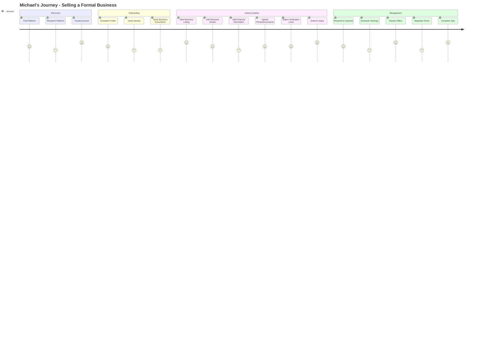
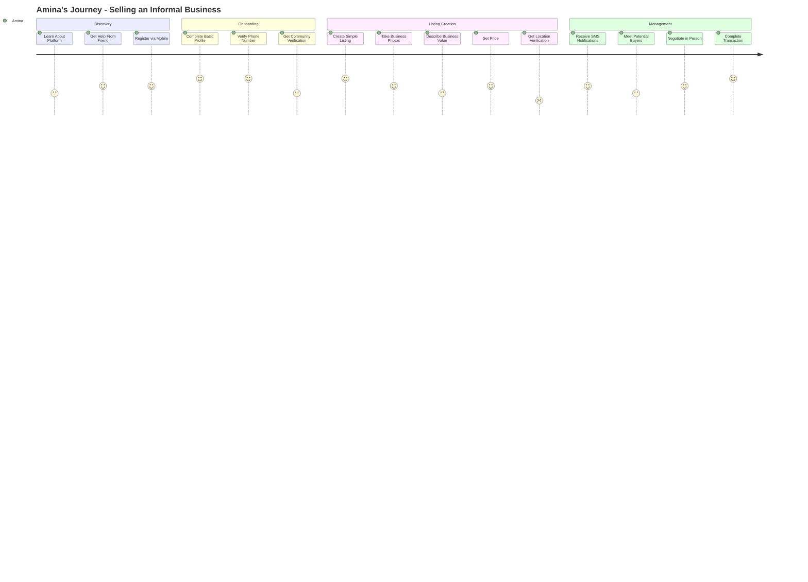
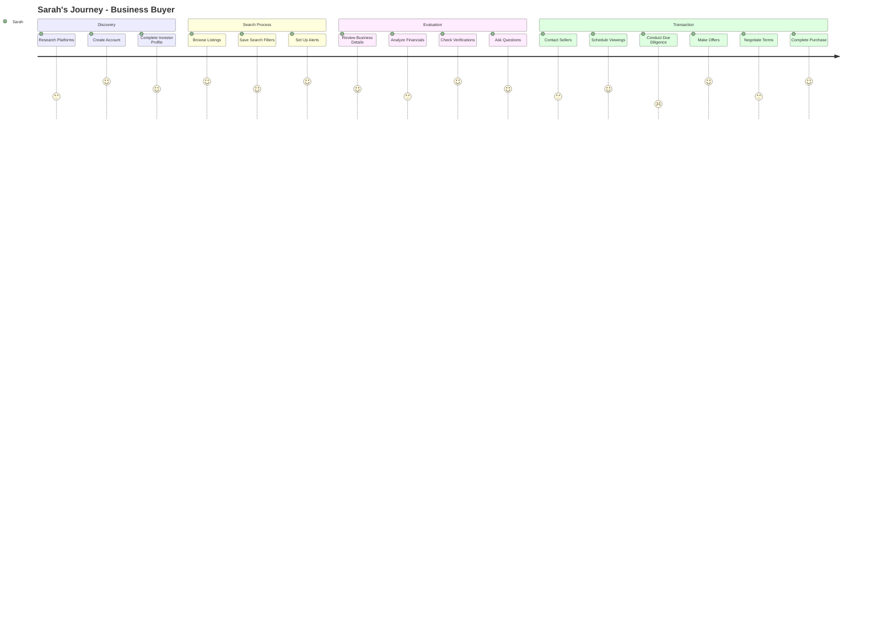
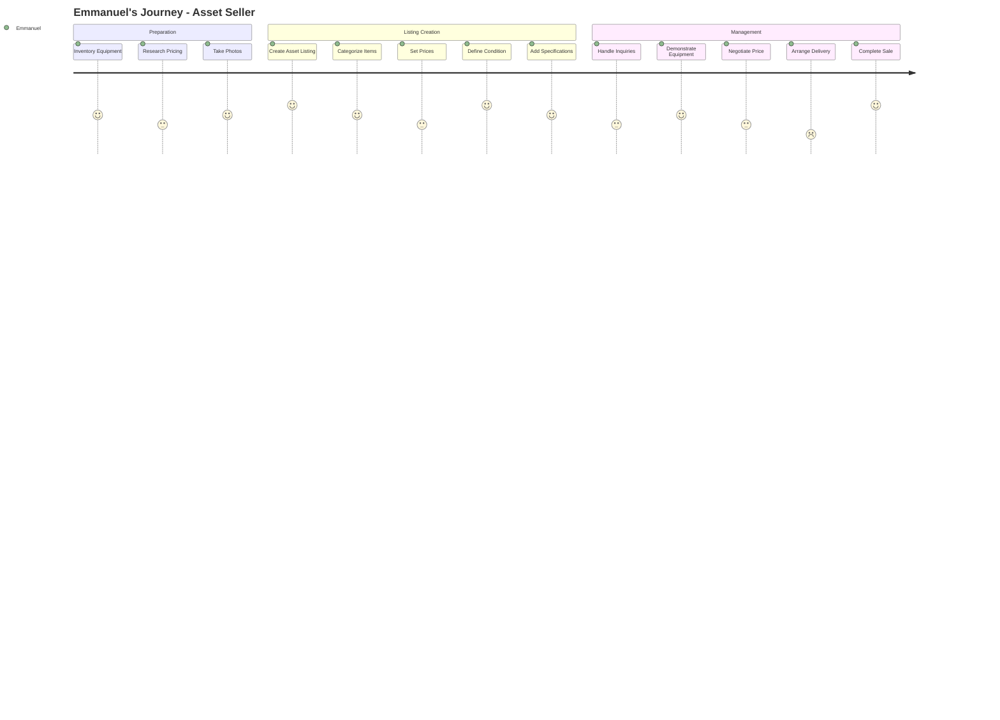
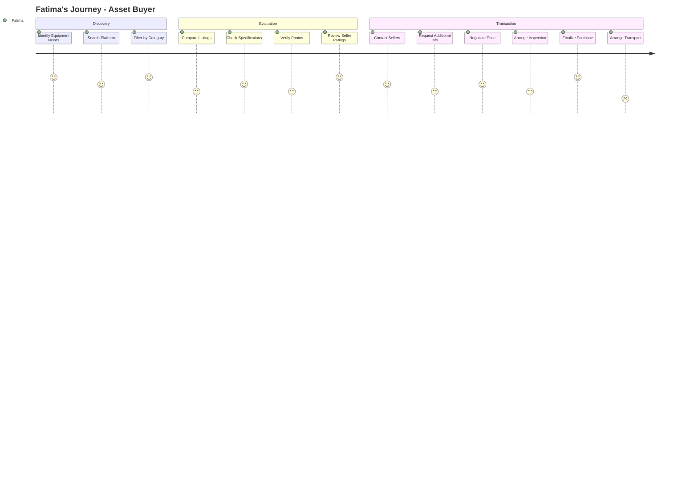
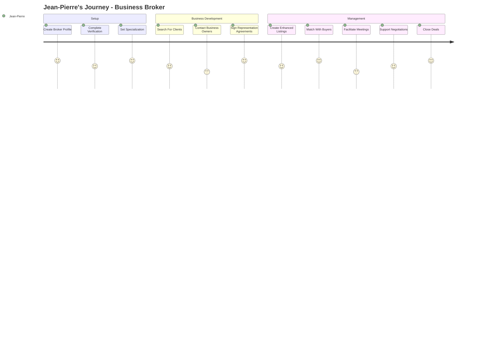
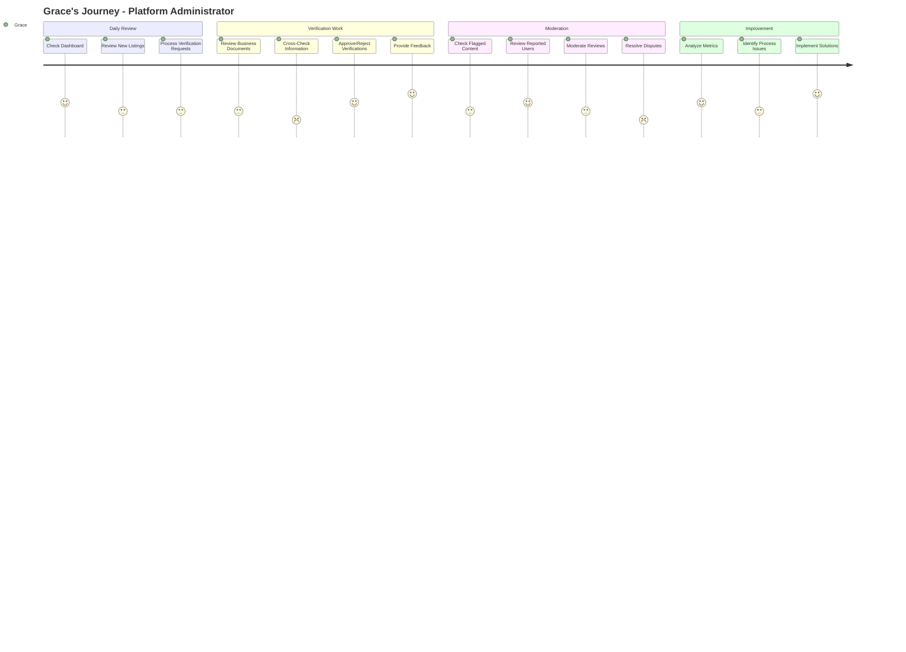

# User Journey Maps

This document outlines the key user journeys within the Connectiverse Africa Business Marketplace Platform, representing the experiences of different user types as they interact with the platform.

## Overview

The platform serves several distinct user types, each with unique goals, challenges, and interaction patterns:

1. **Business Sellers** (formal and informal)
2. **Business Buyers** (individuals and organizations)
3. **Asset Sellers** (business owners, equipment vendors)
4. **Asset Buyers** (businesses, individuals)
5. **Agents and Brokers** (intermediaries)
6. **Administrators** (platform managers)

## Business Seller Journey (Formal Business - Tier 1/2)

### Persona: Michael Okafor
- **Profile**: Owner of a registered pharmacy chain in Lagos, Nigeria
- **Goals**: Sell his business to focus on a new venture
- **Challenges**: Finding serious buyers, valuing his business accurately, maintaining confidentiality

### Journey Details

1. **Discovery Phase**
   - Searches online for "how to sell my pharmacy business in Nigeria"
   - Discovers platform through Google search or social media
   - Reviews platform features and success stories
   - Creates account using email or social login

2. **Onboarding Phase**
   - Completes personal profile with business background
   - Verifies identity through government ID upload
   - Uploads business registration documents (CAC certificate)
   - Receives verification badge after admin review

3. **Listing Creation Phase**
   - Starts new business listing in seller dashboard
   - Completes business details (name, location, industry, employees)
   - Adds financial information (revenue range, profits, growth rate)
   - Uploads business photos and supporting documents
   - Sets asking price and negotiation preferences
   - Chooses visibility settings (public vs. anonymous listing)
   - Submits listing for review

4. **Management Phase**
   - Responds to buyer inquiries through in-app messaging
   - Schedules business viewings with qualified buyers
   - Reviews and compares offers from multiple buyers
   - Negotiates terms within the platform's secure environment
   - Accepts final offer and proceeds to transaction

5. **Transaction Phase**
   - Connects with buyer through platform's secure channel
   - Uses platform's document sharing for due diligence
   - Completes sale with optional platform transaction services
   - Leaves review for buyer and platform experience

## Business Seller Journey (Informal Business - Tier 3/4)

### Persona: Amina Danjuma
- **Profile**: Owner of a small market stall selling fabrics in Kano, Nigeria
- **Goals**: Sell her informal business to relocate to another city
- **Challenges**: No formal documentation, proving business value, finding trusted buyers

### Journey Details

1. **Discovery Phase**
   - Learns about platform from community outreach program
   - Gets assistance from a friend to understand the platform
   - Registers using mobile phone number via USSD or simplified web form

2. **Onboarding Phase**
   - Creates basic profile with minimal information
   - Verifies identity through phone number verification
   - Gets community leader endorsement
   - Receives community-verified badge

3. **Listing Creation Phase**
   - Creates simplified business listing
   - Takes photos of her stall using mobile phone
   - Provides basic business information (products, location, customers)
   - Estimates monthly income and provides sales information
   - Sets asking price based on inventory and goodwill
   - Gets location verified through GPS and photos

4. **Management Phase**
   - Receives SMS notifications about interested buyers
   - Communicates with buyers through platform's messaging or SMS
   - Meets potential buyers at her business location
   - Shows business operations and inventory to buyers
   - Negotiates terms in person with platform guidance

5. **Transaction Phase**
   - Agrees on terms with buyer
   - Uses platform's simple agreement template
   - Completes handover with optional platform representative
   - Provides feedback on platform experience

## Business Buyer Journey

### Persona: Sarah Mensah
- **Profile**: Investor from Ghana looking to acquire SMEs in West Africa
- **Goals**: Find profitable businesses with growth potential
- **Challenges**: Evaluating business credibility, accurate financial assessment, cross-border transactions

### Journey Details

1. **Discovery Phase**
   - Searches for "invest in African businesses" online
   - Creates account with detailed investor profile
   - Sets up investment preferences (industries, locations, price range)
   - Verifies identity to access full platform features

2. **Search Process**
   - Uses advanced search filters (location, industry, price, verification level)
   - Saves preferred search criteria
   - Sets up email/SMS alerts for new matching listings
   - Browses businesses based on verification status and reviews
   - Adds promising businesses to favorites

3. **Evaluation Phase**
   - Reviews detailed business information
   - Analyzes financial documents where available
   - Checks business verification status and badges
   - Reviews Q&A section for additional insights
   - Asks questions to business owners through platform

4. **Transaction Phase**
   - Contacts sellers of interest through secure messaging
   - Schedules virtual or in-person business viewings
   - Conducts due diligence with platform-provided templates
   - Makes offers through the platform's offer system
   - Negotiates terms with sellers securely
   - Completes purchase with optional escrow services
   - Leaves review for seller and platform

## Asset Seller Journey

### Persona: Emmanuel Adeyemi
- **Profile**: Restaurant owner in Nairobi looking to sell kitchen equipment
- **Goals**: Quickly sell unused equipment at a fair price
- **Challenges**: Reaching the right buyers, shipping logistics, demonstrating equipment condition

### Journey Details

1. **Preparation Phase**
   - Inventories equipment to be sold
   - Researches current market prices for similar equipment
   - Takes detailed photos of each item
   - Gathers original documentation and specifications

2. **Listing Creation Phase**
   - Creates asset listings from dashboard
   - Categorizes items properly (Food Service Equipment)
   - Provides detailed specifications for each item
   - Defines condition accurately (Excellent, Good, Fair)
   - Sets competitive prices based on market research
   - Indicates shipping/pickup options

3. **Management Phase**
   - Responds to buyer inquiries about equipment
   - Provides additional information when requested
   - Demonstrates equipment functionality (video/in-person)
   - Negotiates price within acceptable range
   - Arranges delivery or pickup logistics

4. **Transaction Phase**
   - Accepts offers through the platform
   - Completes transactions securely
   - Arranges handover of equipment
   - Provides warranty information if applicable
   - Updates listing status or removes sold items
   - Receives buyer ratings and reviews

## Asset Buyer Journey

### Persona: Fatima Nkosi
- **Profile**: Small business owner from South Africa looking for affordable manufacturing equipment
- **Goals**: Find good quality used equipment at lower than new prices
- **Challenges**: Assessing equipment condition remotely, arranging transport, ensuring seller reliability

### Journey Details

1. **Discovery Phase**
   - Identifies specific equipment needs for her business
   - Searches platform using equipment type and specifications
   - Filters by location, price range, and condition
   - Compares multiple listings side by side

2. **Evaluation Phase**
   - Reviews detailed equipment specifications
   - Examines photos carefully for condition assessment
   - Checks seller verification status and ratings
   - Reads reviews from previous buyers
   - Calculates total cost including transport

3. **Transaction Phase**
   - Contacts selected sellers with specific questions
   - Requests additional photos or videos if needed
   - Negotiates final price and delivery terms
   - Arranges in-person inspection when possible
   - Makes secure payment through platform
   - Arranges transport or pickup
   - Confirms receipt and condition of equipment
   - Leaves feedback for seller

## Agent/Broker Journey

### Persona: Jean-Pierre Kwame
- **Profile**: Business broker specializing in hotel and hospitality businesses across Africa
- **Goals**: Find businesses to represent, connect buyers and sellers efficiently
- **Challenges**: Building trust online, managing multiple listings, demonstrating value to clients

### Journey Details

1. **Setup Phase**
   - Creates specialized broker profile
   - Completes enhanced verification process
   - Uploads professional credentials and references
   - Sets industry specialization and service areas
   - Defines commission structure and services offered

2. **Business Development Phase**
   - Searches for potential clients (businesses for sale)
   - Contacts business owners through platform
   - Presents value proposition to potential clients
   - Signs representation agreements through platform
   - Analyzes businesses to create marketing strategies

3. **Management Phase**
   - Creates enhanced listings with professional content
   - Promotes listings to potential buyers
   - Manages inquiries and qualifies potential buyers
   - Arranges viewings and meetings between parties
   - Facilitates information exchange and due diligence
   - Supports negotiation process
   - Helps finalize deals and documentation
   - Earns commission through platform's secure system

## Administrator Journey

### Persona: Grace Okonkwo
- **Profile**: Platform administrator responsible for verification and compliance
- **Goals**: Ensure platform integrity, verify businesses efficiently, moderate content
- **Challenges**: Balancing quick approvals with thorough verification, managing fraudulent listings

### Journey Details

1. **Daily Review Phase**
   - Checks admin dashboard for pending tasks
   - Reviews new business and asset listings
   - Prioritizes verification requests by tier and age
   - Assigns complex reviews to specialized team members

2. **Verification Work Phase**
   - Reviews submitted verification documents
   - Cross-checks information with external databases when possible
   - Verifies business registrations against government records
   - Approves or rejects verification requests with detailed notes
   - Assigns verification badges to approved businesses

3. **Moderation Phase**
   - Reviews flagged content (listings, messages, reviews)
   - Investigates reported users and potential fraud
   - Moderates reviews for compliance with platform guidelines
   - Resolves disputes between buyers and sellers
   - Takes appropriate action on policy violations

4. **Improvement Phase**
   - Analyzes verification metrics and processing times
   - Identifies common issues in the verification process
   - Contributes to process improvement initiatives
   - Provides feedback on verification tools and flows
   - Helps train new administrators

## Cross-Journey Touchpoints

### Key Interaction Points

1. **Business Listing Creation → Buyer Search**
   - Seller creates listing → Appears in buyer search results
   - Metadata and categorization affects discoverability
   - Verification level impacts buyer trust and engagement

2. **Inquiry → Response**
   - Buyer sends inquiry → Seller receives notification
   - Response time affects buyer interest and platform metrics
   - Quality of interaction influences likelihood of viewing

3. **Offer → Negotiation**
   - Buyer submits offer → Seller evaluates and responds
   - Platform facilitates secure negotiation environment
   - Both parties engage in structured negotiation flow

4. **Broker Engagement**
   - Broker connects buyers and sellers
   - Provides professional presentation and validation
   - Facilitates complex negotiations and transactions

5. **Administrator Oversight**
   - Administrator verifies business information
   - Moderates interactions when necessary
   - Ensures platform policies are followed

## Journey Optimization Recommendations

1. **Streamlined Onboarding**
   - Implement tier-specific onboarding flows
   - Create guided tutorials for first-time users
   - Provide contextual help throughout the process

2. **Verification Improvements**
   - Offer partial verification options for informal businesses
   - Implement progressive verification as trust builds
   - Create verification checklists specific to business types

3. **Communication Enhancements**
   - Add multilingual support for key African languages
   - Implement SMS integration for low-connectivity areas
   - Create communication templates for common scenarios

4. **Transaction Support**
   - Develop simplified agreements for informal businesses
   - Create escrow services appropriate to different transaction types
   - Provide deal checklists for both buyers and sellers

5. **Mobile Optimization**
   - Enhance mobile-first experiences for all user journeys
   - Implement offline capabilities for key functions
   - Optimize for low-bandwidth environments