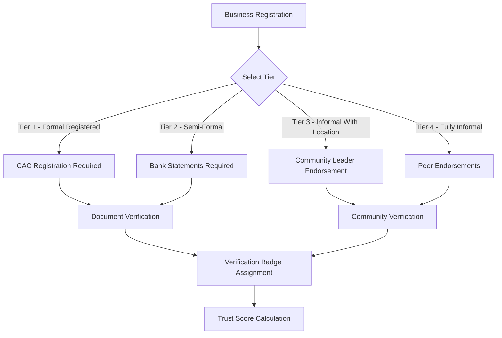
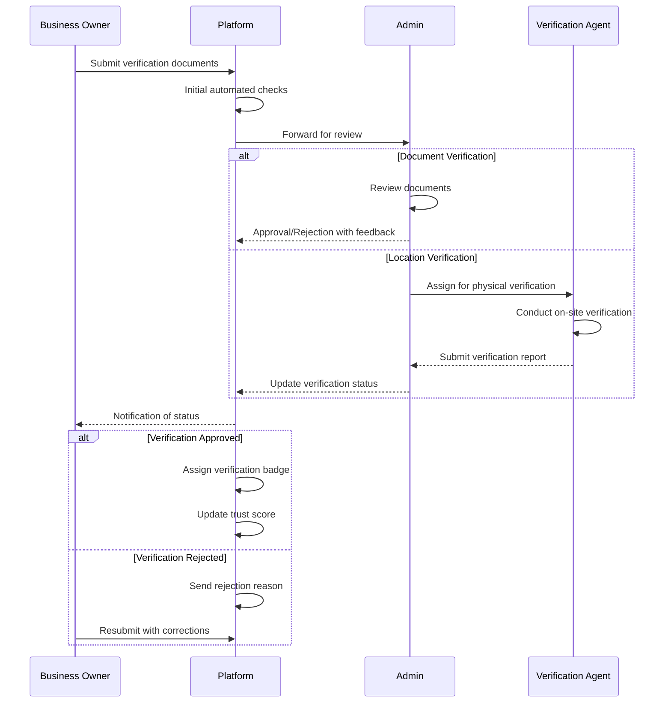

# Verification and Trust Workflow Documentation

This document outlines the verification and trust-building mechanisms implemented in the Connectiverse Africa Business Marketplace Platform. These mechanisms are essential for creating confidence in a marketplace that connects formal and informal businesses across Africa.

## Overview

The platform implements a multi-layered trust system that includes:

1. User identity verification
2. Business documentation verification
3. Financial information verification
4. Physical location verification
5. Community endorsements
6. Ratings and reviews
7. Question and answer systems

## Business Tiers and Verification Requirements

The platform supports businesses across different formality tiers, each with specific verification requirements:



### Tier 1: Formal Registered Businesses
- **Requirements**:
  - Corporate Affairs Commission (CAC) registration documents
  - Tax identification number
  - Business bank account statements
  - Physical address verification
  - Owner/Director identification
- **Verification Process**:
  - Document upload and manual review by platform administrators
  - Automated database checks against government records (where available)
  - Physical verification (optional enhanced tier)

### Tier 2: Semi-Formal Businesses
- **Requirements**:
  - Any available registration documents
  - Bank statements or mobile money records
  - Physical address verification
  - Owner identification
- **Verification Process**:
  - Document upload and manual review
  - Banking information verification
  - Physical verification through photos/videos

### Tier 3: Informal Businesses with Physical Locations
- **Requirements**:
  - Community leader endorsement
  - Photos of physical business location
  - Owner identification
  - Transaction history (if available)
- **Verification Process**:
  - Endorsement verification with community leaders
  - Photo verification of business location
  - Locality verification through geolocation

### Tier 4: Fully Informal Businesses
- **Requirements**:
  - Peer endorsements (minimum 3)
  - Business activity evidence
  - Owner identification
- **Verification Process**:
  - Peer endorsement verification
  - Review of business activity evidence
  - Community reputation checks

## Verification Types

Each verification type has a specific purpose and process:

### Identity Verification
- **Purpose**: Confirm the identity of the business owner/representative
- **Process**:
  1. Upload government-issued ID document
  2. Submit selfie for facial comparison
  3. Automated and manual review
- **Badge**: "Identity Verified" with user icon

### Revenue Verification
- **Purpose**: Verify the financial information of the business
- **Process**:
  1. Upload bank statements or financial records
  2. Submit tax documents (if applicable)
  3. Manual review by financial specialists
- **Badge**: "Revenue Verified" with financial icon

### Document Verification
- **Purpose**: Confirm business registration and legal status
- **Process**:
  1. Upload business registration documents
  2. Submit licenses and permits
  3. Automated check against government databases (where available)
  4. Manual review
- **Badge**: "Documentation Verified" with document icon

### Location Verification
- **Purpose**: Confirm the physical location of the business
- **Process**:
  1. Submit photos of business location
  2. Geolocation tagging
  3. Address verification through utility bills
  4. Optional on-site verification by agents
- **Badge**: "Location Verified" with location pin icon

### Ownership Verification
- **Purpose**: Confirm legal ownership of the business
- **Process**:
  1. Submit ownership documents
  2. Cross-reference with identity verification
  3. Manual review
- **Badge**: "Ownership Verified" with shield icon

## Community Endorsement System

The platform leverages community trust mechanisms, particularly important for Tier 3 and Tier 4 businesses:

### Community Leader Endorsements
- **Who Can Endorse**: Verified community leaders (chiefs, association heads, religious leaders)
- **Process**:
  1. Business owner requests endorsement via the platform
  2. System sends verification link to leader
  3. Leader completes endorsement form
  4. Platform verifies leader's identity
  5. Endorsement badge assigned upon approval

### Peer Endorsements
- **Who Can Endorse**: Verified users who have transacted with the business
- **Process**:
  1. Business owner nominates peers who can vouch for them
  2. System sends endorsement requests
  3. Peers complete endorsement forms
  4. Endorsements are publicly displayed
- **Requirements**: Minimum 3 endorsements required for Tier 4 businesses

## Verification Workflow

The verification workflow consists of submission, review, and verification steps:



### Document Submission
1. Business owner selects verification type in Verification Center
2. System presents document requirements based on business tier
3. Owner uploads required documents
4. System performs initial validation (file type, size, completeness)
5. Submission is queued for review

### Review Process
1. Admin dashboard displays pending verification requests
2. Admin reviews submitted documents
3. For Tier 1-2 businesses, admin may cross-check with external databases
4. For Tier 3-4 businesses, community endorsements are evaluated
5. Admin marks verification as approved, rejected, or pending additional information

### Badge Assignment
1. Upon approval, verification badge is automatically assigned to the business
2. Badge appears on business listing
3. Verification status is recorded in database
4. Business owner is notified of successful verification

## Trust Score Calculation

The platform implements a trust score algorithm that weighs various factors:

### Trust Score Components
- **Verification Badges**: Each badge contributes points to the trust score
  - Identity Verification: 15 points
  - Revenue Verification: 20 points
  - Document Verification: 20 points
  - Location Verification: 15 points
  - Ownership Verification: 15 points
  
- **User Reviews**: Average rating contributes up to 25 points
  - 5 stars: 25 points
  - 4 stars: 20 points
  - 3 stars: 15 points
  - 2 stars: 10 points
  - 1 star: 5 points
  
- **Community Endorsements**: Each endorsement adds 5 points (max 15 points)

- **Profile Completeness**: Up to 10 points for complete profiles

- **Platform Activity**: Up to 10 points based on responsiveness and activity

### Trust Score Calculation Formula
```
Trust Score = Sum of Verification Points + 
              Review Points + 
              Endorsement Points + 
              Profile Completeness Points + 
              Activity Points
```

### Trust Score Tiers
- **Highly Trusted**: 85-100 points
- **Trusted**: 70-84 points
- **Moderately Trusted**: 50-69 points
- **Basic Trust**: 30-49 points
- **Limited Trust**: Below 30 points

## Review and Question System

The platform includes a review and Q&A system that contributes to trust:

### Reviews
- Users can leave star ratings (1-5) and written reviews
- Reviews are publicly displayed on business listings
- Business owners can respond to reviews
- Flagging system for inappropriate reviews
- Review verification (verified purchase)

### Questions and Answers
- Users can ask questions about businesses
- Business owners and other users can provide answers
- Upvoting system for helpful answers
- Questions and answers are publicly displayed
- Topics can be organized by category

## Trust Challenges and Mitigation

### Fake Reviews and Endorsements
- **Mitigation**: 
  - User verification requirements before reviewing
  - Review analysis for suspicious patterns
  - Limitation on number of reviews per user
  - Flagging system for suspicious activity

### Document Forgery
- **Mitigation**:
  - Cross-verification with multiple sources
  - Machine learning for document authenticity detection
  - Manual review by trained staff
  - Periodic re-verification

### Identity Theft
- **Mitigation**:
  - Multi-factor authentication
  - Biometric verification where possible
  - Phone number verification
  - Suspicious activity monitoring

## Implementation Recommendations

1. **Phased Verification Rollout**
   - Start with basic identity and document verification
   - Add revenue and location verification as platform matures
   - Introduce community endorsements after establishing core user base

2. **Third-Party Verification Integration**
   - Partner with verification services for specific regions
   - Integrate with government databases where available
   - Explore blockchain-based verification solutions

3. **Verification Incentives**
   - Featured placement for verified businesses
   - Reduced commission rates for highly verified businesses
   - Special badges and recognition

4. **Trust Education**
   - Educational content on the importance of verification
   - Tutorials on completing verification processes
   - Regional workshops for informal businesses

5. **Continuous Improvement**
   - Regular review of verification effectiveness
   - Adjustment of trust score algorithm based on user feedback
   - Addition of new verification types as needed